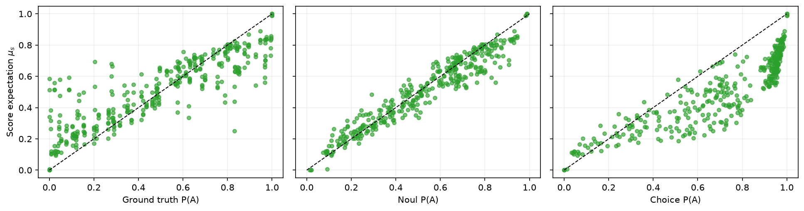

# Sys1Cal




Sys1Cal is a benchmark for probability fidelity and semantic evaluation of Jev-like typed decision models. It asks a narrow question: when the correct probability is exactly specified by the input state, does a model recover that probability, preserve it across equivalent representations, and expose compatible semantics through Noul, Choice, and Score?

The benchmark is fixed. Models should adapt to the released JSONL contract, not the other way around.

## What Sys1Cal Measures

Sys1Cal complements JevBench rather than replacing it. JevBench is a broad typed-decision benchmark: it evaluates useful decision behavior across tasks such as routing, judging, policy checks, classification, ordinal scoring, validity, latency, cost, Brier score, and top-label calibration.

Sys1Cal is narrower and more semantic. It procedurally constructs probability problems where the true distribution is known exactly, renders the same latent problem in multiple equivalent forms, and compares typed primitives on the same proposition. This exposes failures that can be invisible to ordinary argmax accuracy.

The benchmark focuses on:

- **Probability recovery**: does the returned probability match the exact gold probability?
- **Pointwise probability fidelity**: how close is the predicted distribution to the exact conditional distribution for this state?
- **Representation sensitivity**: do equivalent renderings produce equivalent predictions?
- **Cross-primitive consistency**: do Noul, Choice, and Score behave as if they expose the same probabilistic object?

## How The Benchmark Was Created

The first implementation, generators, report code, and paper draft were created with Codex GPT-5.5 High under human direction. The dataset is synthetic and procedural: each item is generated from Python code with exact latent parameters, then rendered into JSONL.

The benchmark is not a hand-labeled natural-language dataset. Its reliability comes from deterministic construction and checks:

- fixed seeds and versioned release files;
- exact gold distributions computed by Python generators;
- `validate_distribution` checks for normalized, non-negative distributions;
- latent consistency checks requiring all representations of the same latent item to share the same gold distribution;
- oracle baseline checks, where the oracle must have zero TV error;
- pytest coverage for generators, renderers, adapters, metrics, repeat aggregation, Noul/Choice/Score analysis, and report generation;
- fixed release JSONL files under [datasets/generated](datasets/generated), which are the canonical inputs for the reports in this repository.

## Fixed Releases

Use the generated release files under [datasets/generated](datasets/generated) for comparable results.

- `v0.1.0_tiny_cleanvars_binary.jsonl`: 365 binary truth-status items for Choice-like and binary probability-recovery experiments.
- `v0.1.0_tiny_cleanvars_parallel_primitives.jsonl`: 365 binary truth-status items with one shared state/proposition and parallel `queries.noul`, `queries.choice`, and `queries.score` definitions.

The parallel primitive release is the core Sys1Cal contract for comparing Noul-like, Choice-like, and Score-like responses. If you publish results, report the dataset filename, model config, repeat count, and report artifact directory.

## Noul, Choice, And Score

Sys1Cal treats the three primitives as distinct response types:

- **Noul-like**: returns one scalar probability that a proposition is true. In binary evaluation this becomes `{"True": p, "False": 1 - p}`.
- **Choice-like**: returns a categorical distribution over explicit options, usually `False` and `True` in the parallel primitive benchmark.
- **Score-like**: returns a distribution over ordered truth levels. Sys1Cal evaluates the expected normalized truth value, using levels `j / 9` for `j = 0,...,9`, while preserving the full Score distribution for semantic analyses.

## Question Representations

Each latent probability problem can be rendered in several equivalent forms:

- `direct`: sufficient statistics or probabilities are stated directly.
- `counts`: probabilities are represented as finite counts.
- `scaled_counts`: the same count information at a larger scale.
- `ratio`: binary or multiclass probabilities are written as ratios or parts.
- `table`: contingency tables, Bayes tables, or step tables.
- `nested`: the same state in a nested JSON structure.
- `prose`: a natural-language rendering of the same state.
- `distractor`: the sufficient state plus irrelevant fields that should be ignored.

All representations of the same `latent_instance_id` have the same gold distribution. That is the hook for measuring representation sensitivity.

## JSON Example

This is a condensed example of one latent question and equivalent representations. Release rows are JSONL, so each rendered representation appears as its own row.

```json
{
  "latent_instance_id": "explicit_probability__seed_000042",
  "family": "explicit_probability",
  "proposition": "Event A is true.",
  "gold_distribution": {
    "True": 0.3,
    "False": 0.7
  },
  "representations": {
    "direct": {
      "representation": "direct",
      "sufficient_statistics": {
        "p_A": 0.3,
        "p_not_A": 0.7
      }
    },
    "counts": {
      "representation": "counts_equivalent",
      "counts": {
        "A": 300,
        "not_A": 700
      },
      "sampling": "uniform"
    },
    "ratio": {
      "representation": "ratio",
      "probability_ratio_A_to_not_A": "3:7"
    },
    "prose": {
      "representation": "natural_language",
      "description": "The state fully determines the target distribution. The probability of A is 0.3, and the remaining probability belongs to the other outcome."
    }
  },
  "queries": {
    "noul": {
      "proposition": "Event A is true."
    },
    "choice": {
      "question": "What is the truth status of the following proposition?",
      "proposition": "Event A is true.",
      "options": ["False", "True"]
    },
    "score": {
      "question": "To what degree is the following proposition true?",
      "proposition": "Event A is true.",
      "levels": [
        "Completely false",
        "Very strongly false",
        "Strongly false",
        "Moderately false",
        "Slightly false",
        "Slightly true",
        "Moderately true",
        "Strongly true",
        "Very strongly true",
        "Completely true"
      ],
      "normalized_level_values": [0.0, 0.1111111111, 0.2222222222, 0.3333333333, 0.4444444444, 0.5555555556, 0.6666666667, 0.7777777778, 0.8888888889, 1.0]
    }
  }
}
```

## Headline Summary

Reports write `benchmark_summary.csv` when built from a result directory. The intended headline table has one row per model and response type:

- **Accuracy**: argmax accuracy against the exact gold argmax.
- **Pointwise Probability Fidelity**: `1 - TV`, where `TV = 0.5 * sum_k |p*_k - p_hat_k|`.
- **Mean TV Error**: the mean total variation distance. For binary True/False questions this is exactly absolute probability error, `|p - p_hat|`.
- **Noul-Choice R2**: squared Pearson correlation between Noul truth probability and Choice truth probability over complete triples.
- **Noul-Score R2**: squared Pearson correlation between Noul truth probability and Score expected truth.
- **Score-Choice R2**: squared Pearson correlation between Score expected truth and Choice truth probability.

Rows are reported separately for `noul_like`, `choice_like`, and `score_like` responses, plus an optional `overall` row. TV/MAE remains the primary probability-recovery metric in the detailed tables.

## Quick Start

Install test/report dependencies:

```bash
python3 -m venv .venv
.venv/bin/python -m pip install -r requirements.txt
```

Run the fixed parallel primitive benchmark with mock baselines:

```bash
PYTHONPATH=src .venv/bin/python -m jev_prob_bench.cli run \
  --dataset datasets/generated/v0.1.0_tiny_cleanvars_parallel_primitives.jsonl \
  --models config/benchmark.yaml \
  --output results/run_001

PYTHONPATH=src .venv/bin/python -m jev_prob_bench.cli report \
  --results results/run_001 \
  --output results/run_001/report
```

Run Jev Noul/Choice/Score through the combined parallel runner:

```bash
export JEV_API_KEY="..."
export JEV_API_URL="https://api.typesafe.ai/v1/systemone"

PYTHONPATH=src .venv/bin/python scripts/run_jev_parallel_primitives.py \
  --dataset datasets/generated/v0.1.0_tiny_cleanvars_parallel_primitives.jsonl \
  --output results/jev_parallel_v0.1.0_dev \
  --repeats 10 \
  --parallelism 16

PYTHONPATH=src .venv/bin/python -m jev_prob_bench.cli report \
  --results results/jev_parallel_v0.1.0_dev \
  --output results/jev_parallel_v0.1.0_dev/report
```


Run SemIf as a Choice-like baseline. The checked-in SemIf config uses CUDA and 10 repeats:

```bash
PYTHONPATH=src .venv/bin/python -m jev_prob_bench.cli run \
  --dataset datasets/generated/v0.1.0_tiny_cleanvars_binary.jsonl \
  --models config/models.semif.yaml \
  --output results/semif_binary_tiny_10x_001 \
  --repeats 10

PYTHONPATH=src .venv/bin/python -m jev_prob_bench.cli report \
  --results results/semif_binary_tiny_10x_001 \
  --output results/semif_binary_tiny_10x_001/report
```

Build the combined Jev + SemIf report used for cross-model plots such as `figure_3_representation_sensitivity.png`:

```bash
python3 - <<'PY'
from pathlib import Path

inputs = [
    Path('results/jev_parallel_tiny_10x_parallel_002/results.jsonl'),
    Path('results/semif_binary_tiny_10x_001/results.jsonl'),
]
out = Path('results/jev_semif_combined_10x_001')
out.mkdir(parents=True, exist_ok=True)
with (out / 'results.jsonl').open('w', encoding='utf-8') as dst:
    for path in inputs:
        with path.open('r', encoding='utf-8') as src:
            for line in src:
                if line.strip():
                    dst.write(line)
PY

PYTHONPATH=src .venv/bin/python -m jev_prob_bench.cli report \
  --results results/jev_semif_combined_10x_001 \
  --output results/jev_semif_combined_10x_001/report
```

## How to cite
```bibtex
@misc{porcedda2026sys1cal,
  title = {Jev thinks "I don't know", but doesn't say it: Introducing Sys1Cal-v1 Dataset for Probability Calibration},
  author = {Riccardo Porcedda},
  year = {2026},
  eprint = {2609.35342},
  archivePrefix = {arXiv},
  primaryClass = {cs.AI},
  doi = {10.48550/arXiv.2609.35342},
  url = {https://arxiv.org/abs/2609.35342}
}
```

